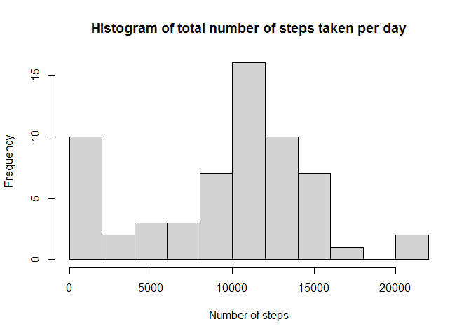

# Reproducible Research: Peer Assessment 01
Maria O. Cruz  

###1) Introduction

This is the first Peer Assessment of the Reproducible Research course in the
Data Science Specialization. The data used for this assignment comes from a
personal activity monitoring device, which collected data from an anonymous
individual every day at five minute intervals, during the months of October and
November, in 2012. 

###2) Loading the data

The first step is setting a temporary working directory and setting the system 
locale to English:

```r
setwd(Sys.getenv("TEMP"))
Sys.setlocale("LC_TIME", "English")
```

The second step is to load the necessary libraries:

```r
library(plyr)
library(lattice)
```

The third step is to download, unzip and read file:

```r
url <- "http://d396qusza40orc.cloudfront.net/repdata/data/activity.zip"
destfile <- "./pa01data.zip"
download.file(url,destfile)
unzip(destfile)
activityData <- read.csv("activity.csv")
```

###3) Calculating the mean of total number of steps taken per day

To determine the total number of steps taken per day, it is necessary to convert
the factor variable to a date variable, and then calculate the sum for each
day removing NAs.

```r
activityData$date <- as.Date(activityData$date)
sumtotal <- ddply(activityData,.(date),summarize,steps=sum(steps,na.rm=TRUE))
head(sumtotal)
```

```
##         date steps
## 1 2012-10-01     0
## 2 2012-10-02   126
## 3 2012-10-03 11352
## 4 2012-10-04 12116
## 5 2012-10-05 13294
## 6 2012-10-06 15420
```

Histogram 01:

```r
hist(sumtotal$steps,breaks=10,xlab="Number of steps",ylab="Frequency",
     main="Histogram of total number of steps taken per day",col="lightgray")
```

 

Calculating mean and median of the total number of steps per day:

```r
totalSteps <-ddply(activityData,.(date),summarize,mean=mean(steps,na.rm=T),
                   median=median(steps,na.rm=T))
head(totalSteps)
```

```
##         date     mean median
## 1 2012-10-01      NaN     NA
## 2 2012-10-02  0.43750      0
## 3 2012-10-03 39.41667      0
## 4 2012-10-04 42.06944      0
## 5 2012-10-05 46.15972      0
## 6 2012-10-06 53.54167      0
```

###4) Calculating average daily activity pattern

Calculating the mean of steps per interval, removing NAs

```r
meantotal <- ddply(activityData,.(interval),summarize,
                   smean=sum(steps,na.rm=TRUE))
head(meantotal)
```

```
##   interval smean
## 1        0    91
## 2        5    18
## 3       10     7
## 4       15     8
## 5       20     4
## 6       25   111
```

Determining the interval with the maximum number of steps:

```r
meantotal$interval[meantotal$smean == max(meantotal$smean)]
```

```
## [1] 835
```

Plot 01 (the red dot indicates the interval with max. number of steps):

```r
plot(meantotal$interval,meantotal$smean, type="l",xlab="Intervals",ylab="Mean",
     main="Plot of mean of steps taken per day")
points(835,max(meantotal$smean),pch=19,col="red")
```

 

###5) Imputing missing values

Reporting the total number of missing values:

```r
table(is.na(activityData$steps))
```

```
## 
## FALSE  TRUE 
## 15264  2304
```

Creating a subset for the mean of all 5 minute intervals and merging with the
original dataset by the "interval" variable

```r
imean <- ddply(activityData,.(interval),summarize,mean=mean(steps,na.rm=T))
alldata <- merge(activityData,imean,by="interval",all.x=T)
```

```r
head(alldata[order(alldata$date),])
```

```
##     interval steps       date      mean
## 1          0    NA 2012-10-01 1.7169811
## 63         5    NA 2012-10-01 0.3396226
## 128       10    NA 2012-10-01 0.1320755
## 205       15    NA 2012-10-01 0.1509434
## 264       20    NA 2012-10-01 0.0754717
## 327       25    NA 2012-10-01 2.0943396
```

Imputing NA values in the "steps" variable with the means of the corresponding
5 minute interval

```r
alldata$steps <- ifelse(is.na(alldata$steps),alldata$mean,alldata$steps)
head(alldata[order(alldata$date),])
```

```
##     interval     steps       date      mean
## 1          0 1.7169811 2012-10-01 1.7169811
## 63         5 0.3396226 2012-10-01 0.3396226
## 128       10 0.1320755 2012-10-01 0.1320755
## 205       15 0.1509434 2012-10-01 0.1509434
## 264       20 0.0754717 2012-10-01 0.0754717
## 327       25 2.0943396 2012-10-01 2.0943396
```

Calculating and reporting the mean and median of total number of steps taken per
day.

```r
noMissingTotal <- ddply(alldata,.(date),summarize,mean=mean(steps),
                        median=median(steps),total=sum(steps))
head(noMissingTotal[,1:3])
```

```
##         date     mean   median
## 1 2012-10-01 37.38260 34.11321
## 2 2012-10-02  0.43750  0.00000
## 3 2012-10-03 39.41667  0.00000
## 4 2012-10-04 42.06944  0.00000
## 5 2012-10-05 46.15972  0.00000
## 6 2012-10-06 53.54167  0.00000
```

Histogram 02:

```r
hist(noMissingTotal$total, breaks=10,xlab="Number of steps",main="Histogram of 
     steps taken per day", col="lightgray")
```

 

###6) Evaluating differences in activity patterns between weekdays and weekends

Checking if day of week or weekend, creating new factor variable and selecting
total per weekday:

```r
dow <- weekdays(alldata$date, abbreviate=T)
alldata$week<- factor(ifelse(dow=='Sat'|dow=='Sun','weekend','weekday'))
weekTotal <- ddply(alldata,.(interval,week),summarize,total=sum(steps))
```

Panel plot:

```r
xyplot(total ~interval|week,data=weekTotal, type="l",xlab="Interval",
       ylab="Number of steps")
```

 

Removing required packages:

```r
detach(package:plyr, unload = TRUE)
detach(package:lattice, unload = TRUE)
```

###7) Conclusions:

With the results at hand, it is possible to answer the following questions:

1. Looking at the means, medians and Histograms of parts 3 and 5 of this 
assignment, is there an observable difference in estimated values? 

*Yes. The main difference between simply removing NAs and imputing missing 
values is that the estimated values obtained from the imputed data have a
slightly higher mean and median, due to the increase of non-zero values.*

2.  What is the impact of imputing missing data on the estimates of the total
daily number of steps?

*The impact of imputing missing data is easily observable comparing Histograms
01 and 02, and the means and medians of both sets of data. Histogram 01 shows
higher frequencies of 0 to 5000 steps, while Histogram 02 shows higher
frequencies of 10000 to 15000 steps.*

3. Are there differences in activity patterns between weekdays and weekends?

*Yes. The panel plot clearly indicates that the activity pattern is significantly
more intense during weekdays when compared to weekends.*
